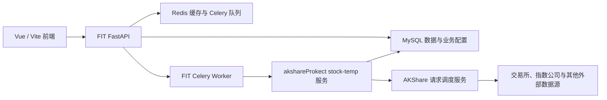

# 局域网测试版本开发与 PR 协作规范

本文档用于指导另一台 Windows 电脑上的 agent 开发 FIT 测试版本，并约束 FIT 与
`akshareProkect` 两个仓库的数据库、采集任务和 Git 协作方式。

> **启用状态：尚未启用。** 当前仓库还没有测试环境启动隔离和采集白名单。
> 测试机必须先完成本文第 5 节规定的基础设施 PR；在该 PR 合并前，禁止把完整后端
> 连接到实时映射测试库，禁止启动 Celery Beat 或真实采集服务。

## 1. 目标与边界

测试环境需要同时满足以下目标：

- 实时读取正式机已有的行情、期权、期货、宏观和量化看板历史数据。
- 测试用户、会话、策略、任务、运行记录和通知与正式环境完全隔离。
- 默认禁止一切真实采集，只允许人工执行当前任务明确新建或修改的采集器。
- 测试代码只通过 Draft PR 进入 GitHub，由正式机 agent 复核后合并。
- 正式机与测试机可以并行开发，但冲突必须在功能分支解决。

本方案不包含以下行为：

- 不把正式 MySQL、Redis、Celery、Flower 或采集服务直接暴露到局域网。
- 不复制正式用户、会话、策略、任务、运行记录、消息或登录状态。
- 不在测试机保存正式数据库管理员密码、短信密钥、SMTP 密码或第三方登录资料。
- 不允许测试环境自动执行采集、通知、额度监控或正式定时任务。
- 不允许测试机直接向两个仓库的 `main` 推送代码。

## 2. 项目架构与仓库职责



### FIT

- `frontend/`：Vue 3、TypeScript、Vite、Pinia、Vue Router 和 Lightweight Charts。
- `backend/`：FastAPI、SQLAlchemy、认证、任务中心、量化计算、研究成果和通知。
- FIT 负责任务定义、任务运行记录和采集结果校验，不直接实现大部分数据抓取。
- Celery Worker 执行手动任务和通知；Celery Beat 每分钟检查到期任务。
- `quant_index_dashboard_daily` 是多个指数页面和策略的预计算看板数据源。

### akshareProkect

- 负责股票、指数、ETF、期货、期权、宏观、情绪及全球风险数据的采集和回补。
- `stock_temp_service.py` 向 FIT 提供日常采集 HTTP 路由，默认监听 `127.0.0.1:8786`。
- `ak_scheduler_service.py` 统一管理 AKShare 上游来源、限流、重试和熔断。
- `run.py` 是手动采集、回补和修复的统一命令入口。
- 采集结果直接写入当前 `AK_DB_NAME` 指向的 MySQL 数据库。

### 正式机当前地址

- 首选主机名：`wanghequandeMacBook-Air.local`
- 当前备用 IPv4：`192.168.1.150`
- MySQL：正式机 `127.0.0.1:3306`
- FIT API：正式机 `127.0.0.1:8000`
- FIT 前端：正式机 `0.0.0.0:5173`
- Redis：正式机 `127.0.0.1:6379`
- AKShare 请求调度：正式机 `127.0.0.1:9000`
- stock-temp：正式机 `127.0.0.1:8786`

IPv4 可能被路由器重新分配。Windows 测试机优先使用 `.local` 主机名；若 mDNS 不可用，
再使用当前 IPv4，并由正式机确认地址没有变化。

## 3. 当前代码的危险点

不能只修改 `DATABASE_URL` 然后启动测试后端，原因如下：

1. `backend/app/main.py` 在 FastAPI 启动时会创建和修改表、索引、系统账号、默认风险策略与默认任务。
2. 默认采集任务会被创建为启用状态，部分任务的名称和执行时间还会在启动时被校正。
3. Celery Beat 每分钟执行 `tasks.dispatch_due_scheduled_tasks`，并每小时执行 Codex 额度监控。
4. 任务中心“立即执行”会先创建运行记录，再向 Celery 队列提交任务。
5. FIT 和 akshareProkect 目前都没有针对测试环境的采集器白名单。
6. stock-temp 的采集路由没有鉴权，不能改成局域网监听并供其他机器调用。
7. 登录、偏好、策略保存、任务管理、消息和开发进度都会写数据库。
8. FIT 当前还会尝试为部分行情表补索引；只读视图不能承受这类 DDL。

因此，本文定义的测试环境必须先通过基础设施 PR 把上述行为隔离。

## 4. 目标测试环境拓扑

| 资源 | 正式环境 | Windows 测试环境 |
| --- | --- | --- |
| 行情与历史数据 | `stock_info` 实体表 | `stock_info_test` 中的只读实时视图 |
| 用户与策略 | 正式业务表 | 测试库空白实体表 |
| 采集输出 | 正式实体表 | 获准表的临时测试实体表 |
| MySQL 网络 | 仅正式机回环地址 | SSH 隧道映射到 `127.0.0.1:3307` |
| Redis | 正式机 Redis | Windows 本机独立 Redis |
| Celery Worker | 正式 Worker | 仅按需启动测试 Worker |
| Celery Beat | 正式 Beat | 永不启动 |
| AK 调度与 stock-temp | 正式机服务 | Windows 本机按需启动 |
| Cookie 与账号 | 正式账号 | 独立测试账号和 `fit_test_session` |
| 外发通知 | 可启用 | 强制关闭 |

正式库必须保持零测试写入。测试机查询正式行情时，数据流为：

```text
Windows FIT -> 127.0.0.1:3307 -> SSH -> 正式机 127.0.0.1:3306
            -> stock_info_test 只读视图 -> stock_info 正式行情表
```

## 5. 强制首个 PR：测试环境隔离与采集白名单

后续业务功能开发前，测试机必须先完成两个相互关联的基础设施 Draft PR。

### 5.1 FIT PR

必须加入并测试以下配置契约：

```dotenv
APP_ENV=lan-test
STARTUP_SCHEMA_MODE=app-only
BOOTSTRAP_DEFAULT_TASKS=false
SCHEDULED_TASKS_ENABLED=false
OUTBOUND_NOTIFICATIONS_ENABLED=false
COLLECTION_EXECUTION_MODE=allowlist
COLLECTION_ALLOWED_KEYS=
AUTH_SESSION_COOKIE_NAME=fit_test_session
CODEX_RESET_WATCHDOG_ENABLED=false
```

实现要求：

- `STARTUP_SCHEMA_MODE=app-only` 只允许创建或迁移测试业务表，不得对行情表或只读视图执行 DDL。
- `BOOTSTRAP_DEFAULT_TASKS=false` 时只建立独立测试账号所需基础结构，不创建正式默认任务和风险通知任务。
- `SCHEDULED_TASKS_ENABLED=false` 时，调度任务即使被误调用也必须返回空结果，不得创建运行记录。
- 不提供测试版 Beat 启动命令；误启动 Beat 时也不能派发任务或发送额度通知。
- `COLLECTION_EXECUTION_MODE=allowlist` 且白名单为空时，所有采集任务都必须被拒绝。
- 任务中心手动执行入口和 Celery Worker 的 `execute_run` 必须分别校验白名单，防止绕过 API。
- 非白名单采集器不得创建 queued/running 记录，不得访问 stock-temp，也不得访问外部数据源。
- `OUTBOUND_NOTIFICATIONS_ENABLED=false` 必须覆盖邮件、短信和站外通知；站内测试消息只能写测试库。
- `/health` 返回环境名、自动调度状态、通知状态、采集策略及当前白名单。
- 前端固定显示“局域网测试环境”，避免把测试页误认为正式页。
- 提供只加载测试环境文件的 Windows 启动入口，并在启动前校验数据库名必须为 `stock_info_test`。

### 5.2 akshareProkect PR

必须加入并测试以下配置契约：

```dotenv
AK_RUNTIME_PROFILE=lan-test
AK_COLLECTION_EXECUTION_MODE=allowlist
AK_ALLOWED_COLLECTORS=
AK_DB_NAME=stock_info_test
```

实现要求：

- 白名单为空时，`run.py` 的采集、回补、修复命令全部默认拒绝。
- stock-temp 每个采集路由在执行 handler 前校验对应 `task_name`。
- 旧的 `/collect` 和 `/collect-forex` 路由也必须映射到稳定采集器键并接受相同校验。
- AKShare 请求调度服务只负责请求排队，本身不得自动启动采集。
- stock-temp 和 AKShare 请求调度继续只监听 Windows 本机 `127.0.0.1`。
- `/health` 返回运行配置、数据库名、采集策略及当前白名单，但不返回密码或密钥。
- 非白名单请求必须在任何上游网络访问和数据库写入之前失败。
- 测试代码直接调用采集函数时使用 mock；真实采集只允许通过受保护的正式入口执行。

### 5.3 合并顺序

1. 两个仓库同时创建 Draft PR，并在说明中相互引用。
2. 先合并 akshareProkect 的生产者侧防护。
3. 再合并 FIT 的调用方防护。
4. 两边合并并由正式机 agent 验证后，才由正式机 agent 创建测试库和 SSH 访问。
5. 基础设施没有完整通过前，测试机只能做单元测试、mock 测试和不连接真实 API 的前端开发。

## 6. 测试数据库规范

### 6.1 数据库与权限

正式机 agent 负责：

- 创建 `stock_info_test`。
- 创建随机强密码的受限账号 `fit_test`。
- 只向 `fit_test` 授予正式 `stock_info` 的 `SELECT` 权限。
- 只向 `fit_test` 授予 `stock_info_test` 的开发权限。
- 所有跨库视图使用 `SQL SECURITY INVOKER`，确保正式库写权限不会被视图定义者继承。
- 不把正式 `fit` 或 `root` MySQL 凭据交给 Windows。

正式 MySQL 继续绑定 `127.0.0.1`。禁止把 Docker 端口改为 `0.0.0.0:3306`。

### 6.2 测试业务实体表

以下表在 `stock_info_test` 中必须是独立空白实体表：

- `users`
- `user_sessions`
- `progress_boards`
- `quant_strategy_configs`
- `scheduled_tasks`
- `scheduled_task_runs`
- `user_notifications`
- `collection_task_requests`
- `collection_task_request_links`

测试环境创建自己的 root 和 guest，不复制正式账号、密码、策略或偏好。

### 6.3 实时只读视图

除独立业务表和获准采集器输出表外，其余已有表均在 `stock_info_test` 中建立指向
`stock_info` 同名表的只读视图。视图查询实时使用正式表数据，不复制约 26.9GB 的整库。

视图需要在正式表新增或删除字段后由正式机 agent 重新生成。测试 agent 不得自行修改
正式表结构来解决视图不兼容。

### 6.4 采集器目标表实体化

测试新建或修改采集器前，PR 必须列出：

- `collector_key`
- 调用入口和 stock-temp 路由
- 所有直接写入表
- 触发的看板重算、缓存清理和间接写入表
- 需要的历史日期范围
- 测试后恢复方式

只有声明过的目标表可以在 `stock_info_test` 中从视图替换为实体表。默认只复制最近
400 个交易日；历史问题需要更长区间时，在 PR 中写明理由。新表直接创建在测试库。

测试结束后：

1. 导出必要的测试摘要，不提交原始数据库文件。
2. 从 FIT 和 akshareProkect 的本地测试白名单中移除采集器。
3. 删除临时测试实体表。
4. 正式表已经部署时恢复同名实时只读视图；正式表尚不存在时保持无表状态。

测试采集数据永不自动同步回正式库。代码合并后，由正式机按照正常任务重新采集正式数据。

## 7. Windows 初始化与连接

### 7.1 基础软件

Windows 测试机需要：

- Git
- GitHub CLI (`gh`)
- Miniconda
- Docker Desktop
- OpenSSH Client
- Chromium（仅在测试 Playwright 采集时安装）

首次克隆：

```powershell
git clone https://github.com/peterwang122/FIT.git
git clone https://github.com/peterwang122/akshareProkect.git

cd FIT
conda env create -f environment.yml
conda run -n FIT npm --prefix frontend ci

cd ..\akshareProkect
conda env create -f environment.yml
```

只有当前白名单采集器依赖浏览器时才执行：

```powershell
conda run -n akshareProkect python -m playwright install chromium
```

### 7.2 SSH 隧道

SSH 用户和私钥由正式机 agent 单独配置，不写入 Git。PowerShell 示例：

```powershell
ssh -N `
  -L 127.0.0.1:3307:127.0.0.1:3306 `
  fit-test-tunnel@wanghequandeMacBook-Air.local `
  -o ExitOnForwardFailure=yes `
  -o ServerAliveInterval=30 `
  -o ServerAliveCountMax=3
```

如果 `.local` 解析失败，在正式机确认地址后临时改用 `192.168.1.150`。不得自行扫描、
开放或转发正式 Redis、API、Flower 和 stock-temp 端口。

### 7.3 本地 Redis

测试机使用独立 Redis：

```powershell
docker run --name fit-lan-test-redis `
  -p 127.0.0.1:6379:6379 `
  -d redis:7.4
```

不要在测试机直接运行 FIT 当前的 `docker compose up -d` 作为正式测试启动方式；基础设施
PR 应提供不会创建多余 MySQL、不会连接正式服务的测试启动入口。

### 7.4 本地环境文件

测试凭据只保存在被 `.gitignore` 排除的本地测试环境文件中。示例仅表示字段，不包含真实值：

```dotenv
APP_ENV=lan-test
DATABASE_URL=mysql+pymysql://fit_test:<TEST_PASSWORD>@127.0.0.1:3307/stock_info_test
REDIS_URL=redis://127.0.0.1:6379/0
AUTH_SESSION_COOKIE_NAME=fit_test_session
ROOT_USERNAME=root_test
ROOT_PASSWORD=<TEST_ROOT_PASSWORD>
GUEST_USERNAME=guest_test
GUEST_PASSWORD=<TEST_GUEST_PASSWORD>
STARTUP_SCHEMA_MODE=app-only
BOOTSTRAP_DEFAULT_TASKS=false
SCHEDULED_TASKS_ENABLED=false
OUTBOUND_NOTIFICATIONS_ENABLED=false
COLLECTION_EXECUTION_MODE=allowlist
COLLECTION_ALLOWED_KEYS=
CODEX_RESET_WATCHDOG_ENABLED=false
STOCK_TEMP_SERVICE_BASE_URL=http://127.0.0.1:8786
FLOWER_URL=http://127.0.0.1:5555
```

akshareProkect 使用同一 SSH 隧道和测试库，但单独维护本地环境文件：

```dotenv
AK_RUNTIME_PROFILE=lan-test
AK_COLLECTION_EXECUTION_MODE=allowlist
AK_ALLOWED_COLLECTORS=
AK_DB_HOST=127.0.0.1
AK_DB_PORT=3307
AK_DB_USER=fit_test
AK_DB_PASSWORD=<TEST_PASSWORD>
AK_DB_NAME=stock_info_test
AK_DB_TIMEZONE=+08:00
```

严禁提交：

- `.env`、`.env.*.local` 和数据库 JSON 凭据
- SSH 私钥
- Cookie、浏览器 profile、抖音或 Coze 登录状态
- SMTP、短信、GitHub Token 和第三方 API Key
- `runtime/`、缓存、数据库导出和 Celery schedule 文件

## 8. 测试服务启动顺序

基础设施 PR 合并前不要执行本节命令。合并后按以下顺序启动：

1. 启动 SSH 隧道。
2. 启动 Windows 本机 Redis。
3. 运行测试环境 doctor，确认数据库名、权限、Redis、调度开关和采集白名单。
4. 启动 FIT API。
5. 启动 FIT 前端。
6. 只有测试异步任务时才启动 FIT Celery Worker。
7. 只有测试白名单采集器时才启动 Windows 本机 AKShare 请求调度和 stock-temp。

禁止启动：

- FIT Celery Beat
- 正式 launchd 服务
- 花生壳及其监控服务
- 正式机 Celery、Redis、Flower 或 stock-temp 的远程连接
- 与当前 PR 无关的 runner daily、backfill 或 repair 命令

同一 Wi-Fi 中访问 Windows 测试前端时，使用 Windows 的局域网地址和 Vite 端口；API 仍通过
Vite 本机代理访问，避免浏览器跨机器直连正式 API。

## 9. 采集任务测试规则

### 9.1 什么可以加入白名单

只有以下情况可以加入白名单：

- 当前 PR 新增的采集器。
- 当前 PR 修改了上游接口、解析、交易日映射、重试、轮询、写库或校验逻辑的采集器。
- 为复现当前 PR 明确缺陷而必须执行的既有采集器。

仅修改前端、展示、查询、策略、缓存或测试时，不得顺带执行采集器。

### 9.2 如何执行

- 白名单只写在测试机本地环境文件，不提交到仓库。
- FIT 与 akshareProkect 的白名单键必须一致。
- 先使用 fixture、mock 和保存的响应完成解析测试，再进行最少次数的真实请求。
- 真实采集只能由任务中心“立即执行”或受保护的 `run.py` 命令人工触发。
- 不允许启动 Beat，不允许临时设置正式时间轮询，不允许让采集器跨夜后台运行。
- 需要验证轮询逻辑时使用缩短时间和 mock 时钟；真实上游只验证单次请求和结果。
- 每次执行前确认目标数据库为 `stock_info_test`，目标表为测试实体表。
- 每次执行后核验原始数据、标准表、派生看板和缓存，不以 HTTP 200 作为成功依据。

### 9.3 明确禁止

- 不允许把正式 `COLLECTOR_BASE_URL` 或 `STOCK_TEMP_SERVICE_BASE_URL` 配到测试机。
- 不允许直接调用未受白名单保护的采集函数绕过入口。
- 不允许测试 SMTP、短信、正式邮件、正式站内通知和 Codex 额度提醒。
- 不允许复用正式抖音/Coze浏览器 profile；需要测试时另行取得用户明确授权。
- 不允许为了让任务“成功”填充旧日期、伪造数据、吞掉缺项或加入前端假值。
- 不允许测试机修改正式任务启用状态、任务时间和运行记录。

## 10. Git 与 PR 工作流

### 10.1 开始任务

测试机的 `main` 只用于同步，不用于开发：

```powershell
git status --short --branch
git switch main
git fetch origin main
git pull --ff-only origin main
git switch -c codex/<task-slug>
```

如果 `main` 有本地改动，立即停止并先查明来源；禁止 reset、checkout 或覆盖不属于自己的改动。

### 10.2 尽早创建 Draft PR

完成范围确认和最小提交后立即创建中文 Draft PR：

```powershell
git push -u origin codex/<task-slug>
gh pr create --draft --base main --head codex/<task-slug>
```

PR 说明必须包含：

- 业务目标与不做事项
- FIT / akshareProkect 影响范围
- 预计和实际修改文件
- 数据库读取表、写入表和结构变化
- 新增或修改的 `collector_key`
- 数据源、官方发布时间和备用源策略
- 是否可能引入未来数据
- 测试环境白名单和实体化表
- 自动测试、手工验证和浏览器截图
- 兼容性、部署顺序和回滚方式
- 关联的另一仓库 PR

### 10.3 跨仓库功能

- FIT 与 akshareProkect 必须各自建分支和 PR。
- 两个 PR 使用相同任务标识并相互链接。
- 采集端先保持向后兼容并先合并，FIT 调用方后合并。
- 不把另一个仓库的文件复制进当前仓库，也不在一个提交中混合两个仓库。
- 任何数据库契约变更都要给出旧 FIT / 新采集端和新 FIT / 旧采集端的行为。

### 10.4 同步主线

正式机与测试机允许自由并行。测试分支转为可审查前必须合并最新主线：

```powershell
git fetch origin main
git merge --no-edit origin/main
```

- 不使用 `git push --force` 或 `--force-with-lease`。
- 不 rebase 已经发布给本机 agent 审查的分支。
- 冲突只能在功能分支解决并重新测试。
- 禁止为解决 PR 冲突直接在正式机 `main` 上临时补丁。

### 10.5 审查与合并

测试机 agent 完成后把 Draft PR 转为 Ready。正式机 agent 负责：

1. 核对 PR head SHA 没有变化。
2. 检查开放 PR 与正式机未提交文件是否重叠。
3. 审查数据口径、来源发布时间、无未来数据和写库范围。
4. 检查敏感文件、运行产物和意外大文件。
5. 在正式机重新运行必要测试和构建。
6. 使用普通 Merge 合并，不使用 Squash 或 Rebase merge。
7. 合并后删除远端功能分支。

PR 合并不等于部署。没有用户明确要求时，不重启正式服务、不执行正式采集、不应用生产数据回补。

## 11. 并行开发与冲突处理

GitHub 看不到正式机尚未提交的改动，因此不能只依赖 PR 的冲突提示。

测试机 agent 开工时在 Draft PR 顶部声明：

- 主要目录和核心文件
- 预计新增的 API、类型和数据表
- 采集器和任务键
- 计划修改的共享常量、缓存版本和启动配置

正式机 agent 在合并前同时检查：

```bash
git status --short
git diff --name-only
git diff --cached --name-only
gh pr diff <PR_NUMBER> --name-only
```

冲突处理原则：

- 两边可以继续并行，不设置长期模块锁。
- 已推送到 `main` 的新改动由测试分支主动合并并适配。
- 正式机未提交改动与 PR 重叠时，由正式机 agent 先比较行为目标，再决定保留或整合，不能机械选择一侧。
- 数据表、API schema、任务键、缓存键和策略字段冲突视为高风险，必须重新跑双方相关测试。
- 同名数据库字段含义不同、同一数据源口径不同或发布时间假设不同，禁止自动合并，必须向用户说明。

## 12. 数据与代码质量规范

### 数据

- 时区统一使用 `Asia/Shanghai`，数据库连接明确设置 `+08:00`。
- 交易日、来源日期、实际可用时间和目标日期必须区分保存。
- 外盘数据只能在当时已经发布后映射到下一可决策的 A 股交易日。
- 滚动百分位、指标训练和策略回放不得读取当日之后的数据。
- 缺失数据返回 `null` 或明确失败，不用 0、旧值或其他品种伪装。
- 任务成功必须校验目标表、目标日期、产品数量和关键字段覆盖。
- 新数据源必须保存来源、原始响应或可审计引用，并记录发布时间。

### 后端与采集

- 优先沿用现有服务、collector、表结构和错误状态，不重复造入口。
- 数据库结构变化必须幂等，并说明生产迁移与回滚方式。
- 采集端变更必须保留现有 API 兼容，不能要求两个服务在同一秒完成部署。
- 不以宽泛异常捕获把真实失败改成成功或跳过。
- 重试只用于暂时性网络或源站问题，解析错误和口径错误应明确失败。

### 前端

- 新独立页面或重大布局改造先提供视觉预览，经用户确认后实现。
- 普通修复可以直接实现，但 PR 必须提供桌面和笔记本尺寸截图。
- 不用前端防御值掩盖后端数据缺失或错误。
- 保持现有 FIT 顶栏、侧栏、卡片、字体、颜色与交互习惯。
- 至少检查 `1440x900`、`1280x800` 和一个更窄视口，无横向漂移、遮挡或文本溢出。

## 13. 测试与验收

### FIT

```powershell
cd FIT
conda run -n FIT python -m pytest backend\tests
conda run -n FIT npm --prefix frontend run build
git diff --check
```

有前端改动时还要验证：

- 登录与刷新
- 目标路由和主要交互
- `1440x900`、`1280x800` 和窄视口截图
- API 错误、空数据和加载状态
- 不影响未修改页面

### akshareProkect

```powershell
cd akshareProkect
conda run -n akshareProkect python -m pytest
git diff --check
```

有采集改动时还要验证：

- fixture 和 mock 解析
- 日期、单位、空值、幂等和失败重试
- 正式源未发布、节假日和旧日期响应
- 白名单外采集器在网络访问前被拒绝
- 白名单采集器只写测试实体表
- 测试结果不会修改正式表

### 基础设施集成验收

基础设施 PR 必须实际证明：

- 测试机能实时查询正式行情视图。
- 正式库的 INSERT、UPDATE、DELETE 和 DDL 均被拒绝。
- 测试业务实体表可以正常登录、保存策略和创建测试任务。
- 空采集白名单时，FIT API、Celery Worker、AK CLI 和 stock-temp 都拒绝采集。
- 单项白名单只允许指定采集器人工执行。
- Windows 没有 Beat 进程，误调用调度函数也不会产生运行记录。
- SMTP、短信、额度监控和其他站外通知均未执行。
- `/health` 和页面都明确标识 `lan-test`。

## 14. 角色与交付检查表

### 测试机 agent

- 只在 `codex/*` 功能分支开发。
- 开工即创建中文 Draft PR。
- 不接触正式管理员凭据和正式服务。
- 不运行 Beat，不运行非白名单采集。
- 维护准确的表、采集器、测试和回滚说明。
- 合并最新 `origin/main` 后重新测试，再请求正式机审查。

### 正式机 agent

- 负责测试库、账号、只读视图和 SSH 隧道的首次配置。
- 合并前检查开放 PR、本地改动和共享契约冲突。
- 独立复核数据口径、来源发布时间和无未来数据。
- 在正式机重跑测试，使用普通 Merge 合并。
- 只有用户明确要求时才部署、重启、正式采集或回补。

### 用户

- 决定业务口径、重大界面设计和存在分歧的数据来源。
- 不需要逐个手动合并 PR；正式机 agent 在完整审查后负责合并。
- 涉及正式数据删除、生产权限、第三方登录或付费资源时仍需用户明确确认。

## 15. 最终红线

遇到任何不确定情况，优先停止真实执行并报告。以下行为无论测试是否紧急都不允许：

- 测试代码写正式数据库。
- Windows 持有正式数据库管理员密码。
- 测试机启动 Celery Beat 或正式定时采集。
- 绕过采集白名单访问上游。
- 把环境文件、Cookie、登录 profile、密钥或数据库导出提交到 Git。
- 在测试机 `main` 直接提交或推送。
- 强制推送、重写已发布分支历史或覆盖另一台机器的改动。
- 未验证就把测试结果同步到正式库或重启正式服务。
